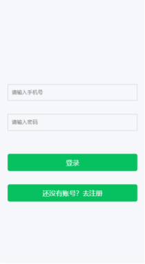
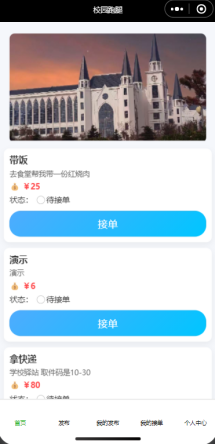
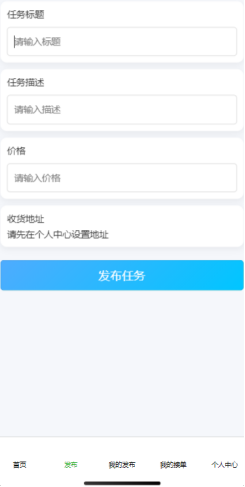

# 校园跑腿服务平台（Campus Errand System）

## 项目简介

校园跑腿服务平台是一个基于 Spring Boot 与微信小程序开发的校园服务系统，旨在为学生提供便捷的任务发布与接单服务。

用户可以在平台发布代取快递、代买商品、代送物品等跑腿任务，也可以浏览并接取其他用户发布的任务，实现校园内资源共享与互助服务。

本项目为软件工程专业毕业设计项目，采用前后端分离架构开发。

---

## 技术栈

### 后端

* Spring Boot
* MyBatis-Plus
* MySQL
* JWT
* Maven

### 前端

* 微信小程序
* WXML
* WXSS
* JavaScript

### 数据库

* MySQL 8.x

---

## 系统功能

### 用户模块

* 用户注册
* 用户登录
* JWT身份认证
* 个人信息管理

### 任务模块

* 发布任务
* 查看任务列表
* 查看任务详情
* 接取任务
* 我的发布
* 我的接单

### 个人中心

* 用户信息展示
* 已发布任务管理
* 已接取任务管理

---

## 项目结构

```text
Campus-Errand-System
│
├── backend                 # Spring Boot后端源码
│
├── front-end               # 微信小程序源码
│
├── sql                     # 数据库脚本
│   └── campus_errand.sql
│
└── README.md
```

---

## 数据库导入

1. 创建数据库

```sql
CREATE DATABASE campus_errand DEFAULT CHARACTER SET utf8mb4;
```

2. 导入数据库脚本

```sql
source campus_errand.sql;
```

或使用 Navicat 执行：

```text
运行 SQL 文件 → campus_errand.sql
```

---

## 后端启动

### 修改数据库配置

文件位置：

```text
backend/campus-errand/src/main/resources/application.properties
```

修改为自己的数据库配置：

```properties
spring.datasource.url=jdbc:mysql://localhost:3306/campus_errand?useUnicode=true&characterEncoding=utf8&serverTimezone=Asia/Shanghai

spring.datasource.username=你的数据库用户名

spring.datasource.password=你的数据库密码
```

### 启动项目

进入后端目录：

```bash
cd backend/campus-errand
```

运行：

```bash
mvn spring-boot:run
```

或直接通过 IntelliJ IDEA 启动：

```text
CampusErrandApplication.java
```
## 微信小程序运行

1. 打开微信开发者工具
2. 导入项目

```text
front-end/campus-errand
```

3. 修改接口地址

```javascript
ctrl+shift+f--> 输入10.16.101.36,替换所有为你的服务器IP地址
```

4. 编译运行

---

## 项目截图

### 登录页面



### 首页



### 发布任务




---

## 开发环境

| 软件            | 版本    |
| ------------- | ----- |
| JDK           | 21   |
| Maven         | 3|
| MySQL         | 8.0  |
| IntelliJ IDEA | 2025.3.3 |
| 微信开发者工具       | 2.01.2510260   |

---

## 项目特点

* 前后端分离架构
* JWT身份认证
* RESTful接口设计
* MyBatis-Plus简化数据库操作
* 微信小程序客户端
* 支持任务发布与接单流程

---

## 作者

刘东润

作者qq：981171606
欢迎联系

---

## License

MIT License
